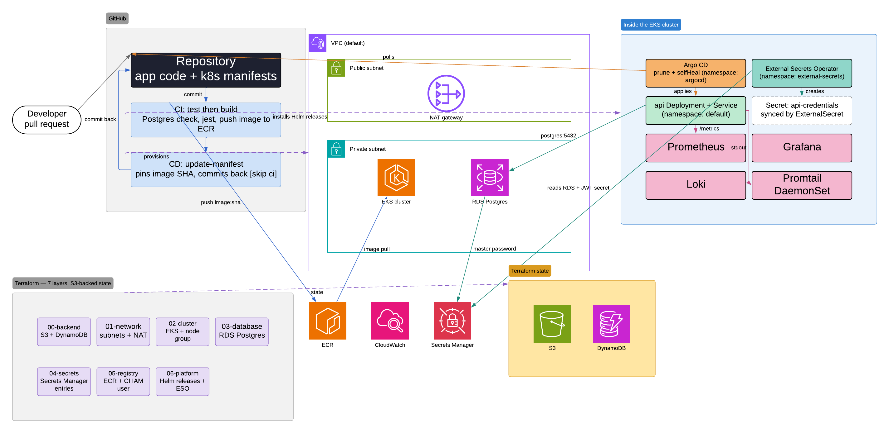

# RealWorld CI/CD Platform

A continuous delivery platform for the [RealWorld](https://github.com/gothinkster/realworld) API. Terraform provisions the cluster and platform, GitHub Actions builds and tests, Argo CD deploys, Prometheus and Loki watch it.

The app itself is the upstream Node/Express + Prisma implementation. I only changed it where the platform I was building had a need — a metrics endpoint, a health check, and the Dockerfile. Everything else here is the platform.

## What's covered

Seven of the eight requirements:

- Tiered architecture — separate app and data tiers
- Containerization — Docker, deployed to Kubernetes( I picked Kind cluster)
- Infrastructure as Code — Terraform provisions cluster and platform
- CI/CD — GitHub Actions builds, Argo CD deploys, merge to master ships
- Observability — Prometheus + Grafana
- Centralized logging — Loki + Promtail
- Backups — Postgres runs on a PVC (StatefulSet), a CronJob runs `pg_dump` daily and keeps the last 7. Restore from one hasn't been tested end to end — see gaps.

Not covered, deliberately:

- **AWS managed services.** Running on EKS/RDS would have spent the time budget on cloud setup rather than pipeline design. This uses [kind](https://kind.sigs.k8s.io/) — same Kubernetes API, same manifests, no cost.

## Stack



Note: Postgres is changed to sts after the diagram was created.

Node 20, TypeScript, Express, Prisma 4, PostgreSQL 16, Nx. Docker on `node:20-slim`. Kubernetes via kind. GitHub Actions, GHCR, Argo CD. Prometheus, Grafana, Loki.

## Layout

```
terraform/01-cluster    kind cluster
terraform/02-platform   Prometheus, Grafana, Loki, Argo CD
k8s/                    app manifests + Argo CD Application + backup CronJob
.github/workflows/      CI and the manifest update job
src/app/metrics.ts      prom-client instrumentation
```

## Running it

```bash
# Cluster, then platform
cd terraform/01-cluster && terraform init && terraform apply
cd ../02-platform && terraform init && terraform apply
```

A few secrets are created by hand, deliberately, so nothing sensitive lands in Terraform state or a committed file:

```bash
# Lets Argo CD read the repo
kubectl create secret generic repo-conduit -n argocd \
  --from-literal=type=git \
  --from-literal=url=https://github.com/laksh63/node-express-cd-platform \
  --from-literal=username=laksh63 \
  --from-literal=password=YOUR_PAT
kubectl label secret repo-conduit -n argocd argocd.argoproj.io/secret-type=repository

# Lets the cluster pull from GHCR
kubectl create secret docker-registry ghcr-pull -n default \
  --docker-server=ghcr.io --docker-username=laksh63 --docker-password=YOUR_PAT

# App and database credentials — pick your own values, don't reuse these
kubectl create secret generic postgres-credentials \
  --from-literal=POSTGRES_USER=<db-user> \
  --from-literal=POSTGRES_PASSWORD=<db-password> \
  --from-literal=POSTGRES_DB=<db-name>
kubectl create secret generic api-credentials \
  --from-literal=DATABASE_URL="postgresql://<db-user>:<db-password>@postgres:5432/<db-name>?schema=public" \
  --from-literal=JWT_SECRET="<jwt-secret>"
```

Then hand Argo the Application and it takes over:

```bash
kubectl apply -f k8s/argocd-application.yaml
```

Migrations are still manual:

```bash
kubectl exec deployment/api -- sh -c \
  "cd /app/api && ./node_modules/.bin/prisma migrate deploy --schema=./src/prisma/schema.prisma"
```

Check it:

```bash
kubectl port-forward service/api 8080:80 &
curl localhost:8080/api/articles     # {"articles":[],"articlesCount":0}
curl localhost:8080/metrics
```

Grafana on `kubectl port-forward -n monitoring svc/monitoring-grafana 3002:80`. Retrieve the admin password with:

`kubectl get secret -n monitoring monitoring-grafana -o jsonpath='{.data.admin-password}' | base64 -d`

Argo UI on `kubectl port-forward -n argocd svc/argocd-server 8081:80`.

Teardown: `terraform destroy` in `02-platform`, then `01-cluster`. PVCs go with it — back up anything worth keeping first.

## How a deploy happens

Merge to master, then:

1. `test` — Postgres service container, migrate, lint, Jest
2. `build` — compile, build image, push to GHCR tagged with the commit SHA
3. `update-manifest` — rewrite `k8s/api.yaml` with that SHA and commit it back with `[skip ci]`
4. Argo CD sees the new commit and syncs the cluster

CI never touches the cluster. It only writes to Git and argoCD pulls. `syncPolicy` has `prune` and `selfHeal` on, so Git is the only way to change the cluster. 

## Terraform is split in two

Terraform resolves provider config at plan time. One config that both creates a cluster and configures the Helm provider from that cluster's credentials can't plan — the credentials don't exist yet. So: cluster first, platform second, separate state.

## Data tier

Postgres runs as a StatefulSet with a `volumeClaimTemplates`- backed PVC. 

Verified by registering a user, deleted `postgres-0`, waited for the replacement, then tried to register the same user again. Got `"has already been taken"`

Backups are a `CronJob` (`k8s/postgres-backup.yaml`) running `pg_dump | gzip` into a second PVC daily, keeping the most recent 7.

## Things that bit me

**Alpine and Prisma.** The upstream Dockerfile used `node:lts-alpine`. Prisma 4's query engine needs OpenSSL 1.1, which Alpine dropped. Container started fine, died on the first database query. Switched to Debian slim — bigger image, works.

**npx grabbing the wrong version.** Production installs skip the Prisma CLI, so `npx prisma generate` inside the image downloaded Prisma 7, which rejected the Prisma 4 schema. Now pinned to 4.16.2 and called from `node_modules/.bin` directly. An unpinned fetch means the build isn't reproducible.

**ServiceMonitor selectors match Service labels, not Service selectors.** Prometheus discovered four targets and dropped all four. The Service had `app: api` under `spec.selector` but no labels on its own metadata. Same key, different field. That one took a while.

**Branch protection versus the deploy automation.** The `update-manifest` job pushes to master, and the ruleset blocked it — first for not being a PR, then for the commit having no `test` run against it. That second one is a genuine deadlock: a commit can't have a passing check before it exists. I ended up relaxing the status-check rule. The real fix is a separate config repo, which is why every serious GitOps setup has two. See gaps.

**A headless service's `clusterIP: None` is immutable.** Moving Postgres to a StatefulSet meant the service also had to go headless. `kubectl apply` tried to patch it in place and Kubernetes refused — that field can only be set at creation. Had to delete and recreate the service.

**The metrics caught a real bug.** First thing they showed was a 500 on `/api/articles` I'd otherwise have missed.

## Other decisions

**Lint doesn't block.** ~40 pre-existing `no-explicit-any` violations in upstream code. Fixing them isn't this exercise. It runs and reports.

**One test suite excluded.** `auth.service.test.ts` — its Prisma mocking doesn't isolate, so tests expecting a rejection get a resolved user from seeded data. Four suites still run and gate. Better to exclude one broken file than make the whole step non-blocking.

**Route labels use the matched pattern**, not the raw path. Otherwise every article slug becomes its own time series and Prometheus falls over.

**Prometheus over VictoriaMetrics.** kube-prometheus-stack gives the operator, exporters and dashboards in one install, and ServiceMonitor is the best-documented scrape pattern. VictoriaMetrics is more efficient and handles long-term retention natively — that matters at scale or if durable history were required. At two pods it isn't observable.

**`GITHUB_TOKEN` where possible, a PAT only where necessary.** The workflow token is minted per run and expires with it. Argo CD and the kubelet run inside the cluster, outside any workflow, so they need a long-lived PAT. That's two more credentials to rotate than I'd like.

## Gaps

1. **Branch protection is weakened.** The status-check rule had to come off master so the deploy bot could push. Right fix: split manifests into a separate config repo, keep full protection on the app repo.
2. **Kubernetes Secrets are base64, not encrypted at rest.** Credentials are out of Git, which was the bigger and cheaper win, but anyone with `kubectl get secret -o yaml` access to the cluster reads them trivially. Real fix is External Secrets Operator pulling from an actual secret manager.
3. **The cluster secrets are created imperatively**, outside Terraform, so nothing sensitive stays in state. Correct for now, but it means a rebuild has manual steps.
4. **Migrations are manual.** If a pod restarts against a fresh database nothing tells you the schema is missing. Should be a Job as a pre-sync hook. I hit this myself rebuilding the cluster — forgot the exact command and lost ten minutes.
5. Backups exist; restoring from one is a manual `gunzip | psql`, untested end to end.
6. **Containers run as root.** The upstream Dockerfile creates an `api` user and never switches to it. No `USER` line, no read-only root filesystem, no dropped capabilities.
7. **No resource requests or limits**, no HPA, no PodDisruptionBudget.
8. **No NetworkPolicies.** Tiers are separated logically but the network is flat. Right now the boundary is a diagram, not a control.
9. **Terraform state is local.** No remote backend, no locking.
10. **`tehcyx/kind` is a community provider.** No official one exists. Fine locally; a real config would use the AWS provider here.
11. **Loki has no persistence.** Logs are in-memory and don't survive a restart — the one place the persistence fix didn't carry through.
12. **No alerting.** Metrics are collected and graphed but no alerts setup. SLOs with burn-rate alerts would be next.

---

Forked from [gothinkster/node-express-realworld-example-app](https://github.com/gothinkster/node-express-realworld-example-app). Original README preserved at [`Docs/UPSTREAM_README.md`](Docs/UPSTREAM_README.md).
